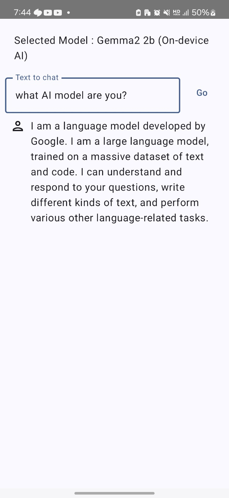
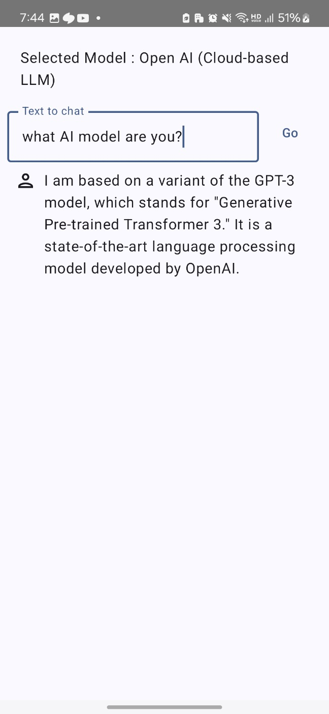

# Android Demo of Hybrid Interactive AI System using LangChain

### Overview

This demo app showcases the feasibility of a Hybrid Interactive AI system that dynamically transitions between on-device AI and cloud-based LLMs using LangChain, depending on the network state, as proposed in my Honors Thesis.

This application must be run on a physical Android device to take advantage of the device GPU.

|                     when using Wi-Fi                     |                     when using Mobile Data or going Offline                     |
|:--------------------------------------------------------:|:-------------------------------------------------------------------------------:|
|  |  |

## Implementation Results

### A. Dynamic model transitions based on network state


### B. Chat Memory Management


## Architecture Design of Hybrid Interactive AI System with LangChain


## Flow Diagram for ConnectivityManager to execute a NetworkRequest


## Build the demo using Android Studio

### Prerequisites

*   The **[Android Studio](https://developer.android.com/studio/index.html)**
    IDE. This sample has been tested on Android Studio Koala.

*   A physical Android device with a minimum OS version of SDK 24 (Android 7.0 -
    Nougat) with developer mode enabled.

*   API key for Cloud-based LLM service

### Building

*   Open Android Studio. From the Welcome screen, select Open an existing
    Android Studio project.

*   From the Open File or Project window that appears, navigate to and select
    the LangChain-bw-OndeviceAI-CloudLLM-main directory. Click OK. You may
    be asked if you trust the project. Select Trust.

*   If it asks you to do a Gradle Sync, click OK.

*   Declare the API Key in `local.properties`. <br>
    ```properties
    openAiApiKey="your_api_key_here"
    ```
    This ensures the API key is securely referenced during the build process and kept out of version control.

*   With your Android device connected to your computer and developer mode
    enabled, click on the green Run arrow in Android Studio.

### Models used

You can download one of the [compatible models](https://developers.google.com/mediapipe/solutions/genai/llm_inference#models).

Once you download it, place it under the path defined as MODEL_PATH in Gemma2ChatModel on the Android device
(eg. /data/local/tmp/llm/model.bin).

The easiest way to do that would be to use Android Studio's [Device Explorer](https://developer.android.com/studio/debug/device-file-explorer).

For more details, see the [models section](https://developers.google.com/mediapipe/solutions/genai/llm_inference/android#model) in the LLM Inference guide for Android.